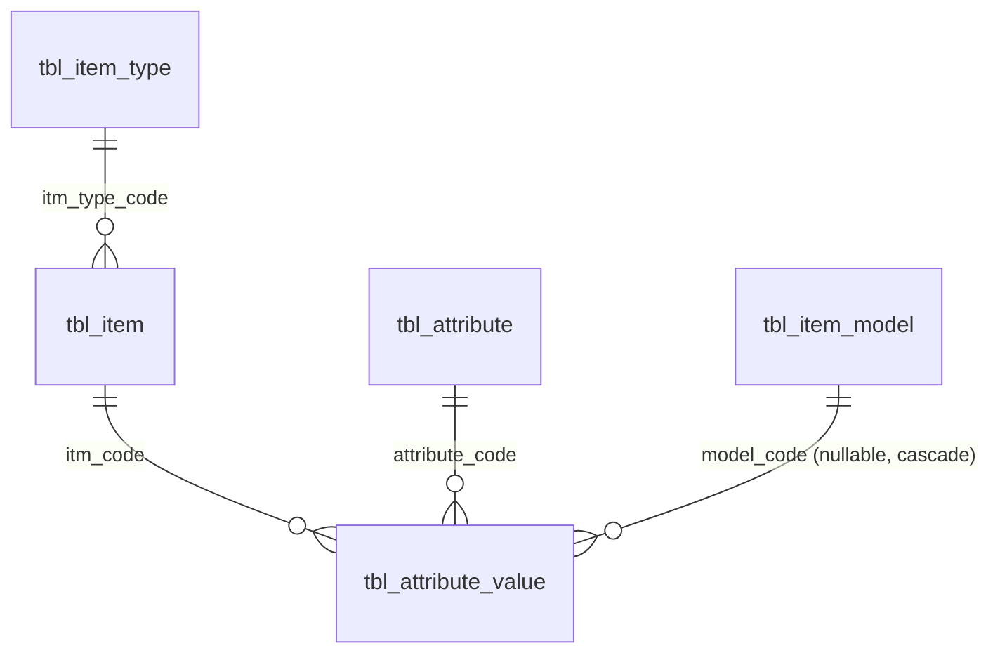

# ฐานข้อมูล (Database)

> อยากได้ภาพรวมทั้งระบบก่อน อ่าน [overview.md](./overview.md)

> **Source of truth**: [`database/schema.prisma`](../database/schema.prisma) — moved out of `backend/prisma/` on 2026-09-02 so every DB-related file lives under `database/`; `backend/package.json`'s `"prisma.schema"` field points Prisma at it (as `database/schema.prisma`, resolved relative to the backend container's own `/app`), and `backend/Dockerfile`/`database/docker-compose.yml` were updated so the build/dev container can still reach it (build context widened to the repo root, plus a `../database:/app/database:ro` mount for dev — kept INSIDE `/app`, not a sibling `/database`, so Prisma's own project-root inference doesn't break; see the Dockerfile's comment).
>
> **⚠️ `docker-compose.yml` also moved into `database/` on 2026-09-02** (was at the repo root) — run `docker compose` commands from inside `database/` now. Its `name: product-compare-app` is pinned explicitly so container/network names (e.g. `product-compare-app_default`, which `restore-full-dump.sh` below depends on) stay the same no matter which directory you run the command from.
>
> **⚠️ 2026-09-01/02**: ฐานข้อมูลถูกสลับทั้งหมดจาก schema ของโปรเจกต์เดิม (`Product`/`Category`/`Attribute`/...) มาเป็น**สำเนาโครงสร้างตารางจริงของ dtcshops.com** (`product_compare_db`, Docker Postgres ในเครื่องเท่านั้น ไม่เชื่อมกับเว็บจริง) — ชื่อตาราง/คอลัมน์เป็นภาษาอังกฤษแบบย่อ (`tbl_item`, `itm_code`, ฯลฯ) ตามต้นฉบับจริง ไม่ใช่ชื่อที่ออกแบบเองอีกต่อไป ดู `CLAUDE.md`'s หัวข้อ Database Schema สำหรับ timeline การเปลี่ยนแปลงเต็ม
>
> **⚠️⚠️ 2026-09-02 — DB มี 20 ตารางแล้ว รวมข้อมูลลูกค้าจริง (PII) บางส่วน ไม่ใช่แค่ 7 ตารางที่แอปใช้งาน**: ตามคำขอผู้ใช้ ("dump มาใส่ทั้งอันเลย") ได้ restore อีก 17 ตารางที่เหลือจาก `dtcshops_db.sql` เข้า `product_compare_db` เพิ่มแล้ว (สคริปต์: [`restore-full-dump.sh`](../database/restore-full-dump.sh)) — **รวม `tbl_order`/`tbl_order_item` (ประวัติสั่งซื้อจริง), `tbl_refunds` (ข้อมูลคืนเงินจริง)** ซึ่งเป็นข้อยกเว้นจากกฎเดิมของโปรเจกต์นี้ที่ตั้งใจไม่เอา PII เข้ามาเลย (ผู้ใช้ยืนยันชัดเจนแล้วว่าต้องการทั้ง 21 ตารางรวม PII หลังถูกถามย้ำ) — **`tbl_users` ตรวจสอบข้อมูลจริงแล้ว (2026-09-02) ว่าไม่ใช่ PII ลูกค้า**: มีแค่ 2 แถว ทั้งคู่เป็นบัญชีแอดมินของเว็บจริง (`username`: `admin`/`dtcadmin`) ไม่มีข้อมูลลูกค้าปนอยู่เลย — เก็บ password hash ของแอดมินเหมือนตารางที่แอปใช้งานจริงอยู่แล้ว ไม่ต่างกันด้านความเสี่ยง; 2 ตารางที่ restore มาแล้วว่างเปล่าและไม่มีโค้ดอ้างอิงเลย (`tbl_item_feature`, `tbl_item_model_products`) ถูก `DROP TABLE` ทิ้งแล้วในวันเดียวกัน (DB จาก 24 ตารางจึงเหลือ 22 และเหลือ 20 หลังลบ `tbl_item_type_feature` ทิ้งอีกตัวเมื่อ 2026-09-09 ด้วยเหตุผลเดียวกัน — ว่างเปล่า ไม่มี FK/โค้ดอ้างอิง) — **ห้ามแชร์ไฟล์ dump/volume ของ DB นี้ต่อสาธารณะ หรือ commit ขึ้น remote repo ที่คนอื่นเข้าถึงได้** เพราะมีข้อมูลคำสั่งซื้อ/คืนเงินจริงปนอยู่ (ไม่มี `.gitignore` ที่ครอบคลุมจุดนี้อีกชั้นในตอนนี้ ควรเพิ่มถ้าจะ push ขึ้น git จริง); Prisma schema/แอป **ใช้ 8 ตาราง** (`tbl_users`/`tbl_item`/`tbl_item_type`/`tbl_item_model`/`tbl_attribute`/`tbl_attribute_value`/`tbl_footer`/`tbl_shop`) — **2026-09-04: ตาราง `Admin` แบบสร้างเอง (ไม่ได้มาจาก dtcshops.com จริง) ถูกลบทิ้ง auth ย้ายไปใช้ `tbl_users` แทน, `tbl_shop` เพิ่มเข้ากลุ่มนี้เพราะได้ public endpoint (`GET /api/shops`) แล้ว** — ตารางที่เหลือแค่ "มีอยู่ใน DB" เฉยๆ ยังไม่มี route/model ใดๆ อ่าน/เขียนมันเลย

## ตารางทั้งหมด

```
tbl_users               user_id (PK, string), username, password (bcrypt hash), flag
                        — admin login (2026-09-04: มีแค่คอลัมน์ที่ auth.js ใช้จริง
                        map ไว้ใน Prisma; ตารางอื่นๆ ของ tbl_users เช่น name/tel/
                        profile ยังไม่ได้ map — ดูหมายเหตุด้านล่าง)

tbl_item_type          itm_type_code (PK, string), itm_type_desc, thumbnail, slug, ...
                        — หมวดหมู่สินค้า (เดิมคือ Category)

tbl_item                itm_code (PK, string เช่น "itm-0000003"), itm_desc (ชื่อสินค้า),
                        itm_flag ('1'=active/'0'=ซ่อน — ทุก query ฝั่ง public/admin กรอง
                        itm_flag:'1' เสมอ, ไม่มี soft-delete flag แยก),
                        itm_price, itm_lowest_price, itm_highest_price,
                        itm_sku (nullable — สินค้าจริง ~19/20 ตัวไม่มีค่านี้),
                        itm_type_code (FK→tbl_item_type),
                        itm_image_master + itm_image_sub1..9 (path รูป — ปัจจุบันเป็น
                        /uploads/products/<YYYY-MM>/<ไฟล์> ชี้ไฟล์ในเครื่อง หลังโหลด
                        รูปมาเก็บเองทั้งหมด 8 ก.ย. 2026 ดู localize-images.js),
                        itm_video_master (ลิงก์ YouTube),
                        itm_information (HTML รายละเอียดสินค้า — สกัดข้อความล้วนผ่าน
                        stripHtml.js ก่อนส่งให้ frontend),
                        itm_model_code (string คั่นด้วยจุลภาค — รายชื่อโมเดล/ตัวเลือก
                        สินค้า ไม่ใช่ FK จริง แค่ list of code, ดูหัวข้อ tbl_item_model),
                        itm_tags, slug, canonical_url, seo_title, seo_desc,
                        itm_shopee/lazada/tiktok/line_end_point (ลิงก์ร้านค้า),
                        itm_guarantee (ความคุ้มครอง), itm_shipping (การจัดส่ง — เพิ่ม
                        ฟอร์มแอดมิน 2 ก.ย. 2026), itm_qty, itm_sold, view,
                        pb_dt/exp_dt (วันที่วางขาย-ถึงวันที่), ist_dt/mdf_dt/rm_dt

tbl_item_model          itm_model_code (PK, string), itm_model_desc (ชื่อโมเดล),
                        itm_model_addon_price (ราคาเพิ่ม/ลด บวกกับ itm_item.itm_price
                        ของสินค้าแม่ — ไม่ใช่ราคาเต็มในตัวเอง), qty

tbl_attribute            attribute_code (PK, int, autoincrement), attribute_name

tbl_attribute_value      id (PK), itm_code (FK→tbl_item), attribute_code (FK→tbl_attribute),
                        value, model_code (FK→tbl_item_model, nullable, **เพิ่มเอง
                        2 ก.ย. 2026** — ไม่ได้อยู่ใน production ต้นฉบับ, ON DELETE CASCADE)
                        — NULL = สเปคที่ใช้ร่วมกันทุกโมเดล, มีค่า = override
                        เฉพาะโมเดลนั้น
```

> **ไม่มี** ตาราง Search_log / Product_view_log / Compare_log / Compare_item อีกต่อไป — ระบบ log/analytics เดิมของโปรเจกต์นี้ถูกตัดออกทั้งหมดพร้อมกับหน้า Dashboard/บันทึกกิจกรรมฝั่ง admin (2026-09-01) เพราะข้อมูลจริงของ dtcshops.com ไม่มีตารางเหล่านี้ — `tbl_item.view` (คอลัมน์ตัวเลขเดี่ยว) เป็นตัวนับยอดเข้าชมที่ใกล้เคียงที่สุดที่มีอยู่จริง ใช้แทนสำหรับการเรียง "ยอดนิยม" (`sort=popular`)

## ความสัมพันธ์หลัก



**หมายเหตุสำคัญ**: `tbl_item` ↔ `tbl_item_model` **ไม่มี FK/join table จริงในฐานข้อมูล** — ความสัมพันธ์อยู่ในรูป string คั่นจุลภาคที่คอลัมน์ `tbl_item.itm_model_code` (เช่น `"K2CC,K2FT"`) เท่านั้น เพราะข้อมูลจริงของ dtcshops.com ถูก denormalize ไว้แบบนี้ — backend (`routes/products.js`'s `parseModelCodes()`/`resolveModels()`) ต้อง split string แล้วไป query `tbl_item_model` เอง ไม่ใช่ Prisma relation include ได้ตรงๆ

## รายละเอียดที่ควรรู้ต่อตาราง

### `tbl_item`
- `itm_price` เป็นราคาของสินค้าที่ **ไม่มีโมเดล** เท่านั้น — ถ้าสินค้ามีโมเดล (`itm_model_code` ไม่ว่าง) และมีอย่างน้อย 1 โมเดลตั้งราคาไว้ (ผ่าน `itm_model_addon_price`) ราคาที่แสดงจริงจะเป็น min/max ของราคาทุกโมเดลแทน (`has_models`/`has_priced_models` สอง flag แยกกัน — ดู `docs/backend.md`)
- ไม่มีคอลัมน์รูปภาพเดี่ยว — `itm_image_master` (ภาพปก) + `itm_image_sub1`..`itm_image_sub9` (สูงสุด 9 ภาพเสริม) รวมกันเป็นแกลเลอรีทั้งหมด (`buildGallery()`)
- `itm_information` เป็น HTML ดิบ — `stripHtml.js`'s `stripHtml()` แปลงเป็นข้อความล้วนก่อนส่งให้ frontend เสมอ (มี guard กันรันซ้ำกับข้อความที่ไม่ใช่ HTML แล้วพังบรรทัดใหม่)
- `slug` ใช้สร้าง URL หน้าสินค้า (`/product/:slug`) แทน `itm_code` ตรงๆ — production มี slug ที่มีความหมาย (ไม่มีอักษรไทย) เติมไว้ให้แล้วเกือบทุกแถว, ฟอร์มแก้ไขสินค้าฝั่งแอดมิน auto-generate จากชื่อสินค้าถ้าเว้นว่างไว้ (`resolveSlug()`, กันชนกันด้วยการต่อเลขท้าย) และไม่เขียนทับ slug เดิมถ้าแค่แก้ชื่อสินค้าเฉยๆ

- **Index (เพิ่ม 10 ก.ย. 2026)** — นอกจาก PK (`itm_code`) และ `idx_tbl_item_type_code` เดิม เพิ่มอีก 4 ตัวตามรูปแบบ query ที่ใช้จริง: `(itm_flag, ist_dt)` (รายการสินค้าค่าเริ่มต้น), `(itm_flag, itm_price)` (เรียงตามราคา), `slug` (เปิดหน้าสินค้าจาก URL), `itm_sku` (เช็ค SKU ซ้ำตอนบันทึก) — ประกาศไว้ทั้งใน `database/schema.prisma` (`@@index`) และ `database/schema.sql`

### `tbl_item_model`
- โมเดล/ตัวเลือกสินค้าของ `tbl_item` เดียวกัน (เช่น "K2 Car Charger"/"K2 Fuse Tap") — ผูกกับสินค้าแม่ผ่าน string ใน `tbl_item.itm_model_code` เท่านั้น ไม่ใช่ FK
- ชื่อ/รูปภาพ/รายละเอียด/ลิงก์ร้านค้า/SEO/Tags ยังอยู่ที่ `tbl_item` (สินค้าแม่) กรอกครั้งเดียวใช้ร่วมกันทุกโมเดล — โมเดลมีแค่ชื่อของตัวเอง/ราคาเพิ่ม/สต็อก (`qty`) และสเปคที่ override ผ่าน `tbl_attribute_value.model_code`
- `itm_model_addon_price` เป็น**ส่วนต่างราคา** บวกกับ `tbl_item.itm_price` ของสินค้าแม่ ไม่ใช่ราคาเต็มของโมเดลนั้นเอง (`modelToCardShape()` คำนวณราคาเต็ม = `itm_price + addon`)

### `tbl_attribute_value`
- `model_code` (FK→`tbl_item_model`, nullable, cascade) เป็นคอลัมน์ที่**เพิ่มเองบน DB นี้เท่านั้น** (2 ก.ย. 2026, ผ่าน `ALTER TABLE` ตรงบน DB จริงในคอนเทนเนอร์ + `prisma db push`/`generate`) — ไม่ได้อยู่ในโครงสร้างต้นฉบับของ dtcshops.com เพราะของจริงไม่มีสเปคระดับโมเดล แต่ DB สำเนานี้ปลอดภัยที่จะขยายเพิ่ม (ต่างจากฐานข้อมูลจริงที่ห้ามแตะ)
- ไม่มี unique constraint ระดับ DB คุมความซ้ำของ (itm_code, attribute_code, model_code) เพราะ Postgres ทำ partial-unique แยกกรณี NULL/not-NULL ได้ยาก — backend (`applyProductAttributes()`) เช็คด้วย `findFirst` ก่อน create/update แทน

## สิ่งที่ **แอป** ไม่ใช้งานโดยตั้งใจ (ต่างจาก "DB ไม่มีตาราง" — ดูหมายเหตุ 2026-09-02 ด้านบน)

> ก่อน 2026-09-02 หัวข้อนี้ชื่อ "สิ่งที่**ไม่มี**ในฐานข้อมูลนี้โดยตั้งใจ" เพราะตอนนั้น DB มีแค่ 7 ตารางที่แอปใช้จริงเท่านั้น — ตอนนี้ตารางพวกนี้**มีอยู่จริงใน DB แล้ว** (restore มาเพิ่ม ดูหมายเหตุด้านบน) แค่ไม่มี route/Prisma model ไหนอ่าน/เขียนมันเลย รายการด้านล่างคือ "แอปนี้ไม่มี business logic รองรับ" ไม่ใช่ "ตารางไม่มีอยู่จริง" อีกต่อไป

- ไม่มีระบบสมัครสมาชิก/login ฝั่งผู้ใช้ทั่วไป — มีแค่ admin login เดียว; **2026-09-04: ย้าย auth จากตาราง `Admin` แบบสร้างเองเดิม (ไม่ได้มาจาก dtcshops.com จริง — ถูกลบทิ้งไปแล้ว) มาใช้ `tbl_users` จริงของ dtcshops แทน** (`routes/auth.js`'s `POST /login`/`GET /me` query `prisma.tbl_users`) — รีเซ็ตรหัสผ่านแถว `username='admin'` เป็นรหัส dev เดิม (`Admin@1234`) ทับ hash จริงที่ restore มา; `tbl_users` มีแค่ 2 แถวเดิม (ทั้งคู่เป็นบัญชีแอดมินของเว็บจริง ไม่ใช่ลูกค้า)
- ไม่มีระบบสั่งซื้อ/ตะกร้าสินค้า/คืนเงิน — `tbl_order`/`tbl_order_item`/`tbl_refunds` มีอยู่จริงใน DB แต่ไม่มี route ไหนแตะเลย
- ไม่มีตาราง refresh token — auth ใช้ JWT อายุ 2 ชั่วโมงตัวเดียว หมดอายุแล้วต้อง login ใหม่
- **อัปเดต 2026-09-08**: `tbl_logs` **ถูกใช้งานจริงแล้ว** (เดิมมีข้อมูล 39,395 แถวแต่ไม่มีอะไรอ่าน) — เป็นแหล่งข้อมูลของแดชบอร์ดหน้าแรกฝั่งแอดมิน (`GET /api/admin/dashboard`) และฝั่ง public เขียน log การเข้าชมต่อเข้าไปด้วย (`utils/activityLog.js`)
  - `type` ที่มีในข้อมูลจริง: `view` (38,976) / `update` (190) / `login` (108) / `insert` (92) / `logout` (26) / `delete` (3)
  - การเข้าชมสินค้าเก็บเป็น `page='product-single'` + **slug ฝังอยู่ในข้อความ** `message='การเข้าดูสินค้า : <slug>'` ไม่ใช่คอลัมน์แยก (ต้อง `split_part` แล้ว join กับ `tbl_item.slug`)
  - แก้ตารางเฉพาะสำเนานี้ (production ไม่มี): เพิ่ม PK บน `id`, sequence + `DEFAULT nextval()`, `DEFAULT now()` บน `created_at`, index บน `(type, created_at)` — ต้นทางไม่มี PK/default เลย จึง insert ไม่ได้ถ้าไม่ใส่ id เอง
- ยังไม่มี route/UI สำหรับ log อื่นๆ (search log, compare log) — ตัดออกพร้อมหน้าบันทึกกิจกรรม (2026-09-01) และโครงสร้างจริงไม่มีตารางรองรับ
- ไม่มีฟีเจอร์นำเข้า Excel (และเลยไม่มีที่เก็บประวัติการนำเข้า) — ถูกตัดออกทั้งหมด (2026-09-01)
- ไม่มี route/UI สำหรับ `tbl_articles`/`tbl_promotion`/`tbl_promotion_item`/`tbl_page`/`tbl_model`/`tbl_item_config`/`tbl_item_option` — restore มาเฉยๆ ตามคำขอผู้ใช้ ยังไม่มีฟีเจอร์ในสโคปที่ต้องใช้ตารางพวกนี้เลย (`tbl_item_feature`/`tbl_item_model_products` ถูกลบทิ้ง 2026-09-02 และ `tbl_item_type_feature` ลบทิ้ง 2026-09-09 ด้วยเหตุผลเดียวกัน — ว่างเปล่าทั้งใน DB เราและใน dump ต้นฉบับ ไม่มี FK/โค้ดอ้างอิงเลย) — **`tbl_shop` ไม่อยู่ในกลุ่มนี้แล้ว** มี admin CRUD เต็มรูปแบบ (`/admin/shops`) และ public read-only endpoint (`GET /api/shops`, 2026-09-04) สำหรับส่วน "DTC Shop & Services" บนหน้าแรก (แผนที่ + carousel การ์ดสาขา) แล้ว
